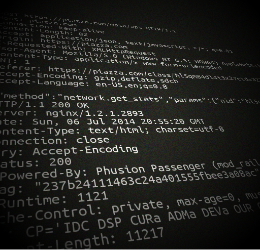
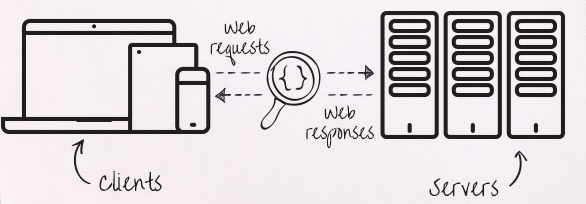
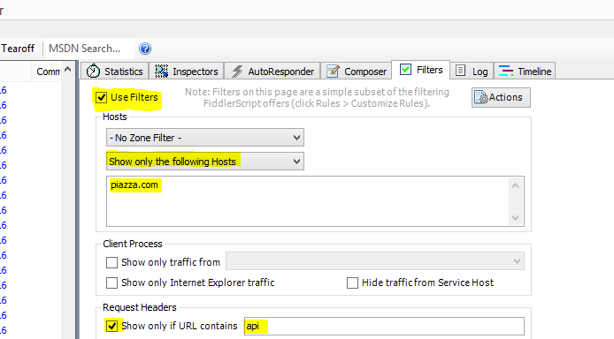

<h1></h1>
<h1>Motivation</h1>
<a href="http://radar.oreilly.com/2013/09/the-myth-of-the-private-api.html" target="_blank">The private API is a myth</a>. <a href="http://piazza.com" target="_blank">Piazza</a> has an internal, i.e., private, API. <a href="https://gist.github.com/alexjlockwood/6797443" target="_blank">This gist is a proof of that concept</a>. It is, of course, every self-respecting snooping user's responsibility to publicize these.
<h1><a title="piazza-api (Click for GitHub)" href="https://github.com/hfaran/piazza-api" target="_blank">piazza-api (Click for GitHub)</a></h1>
I wrote <code>piazza-api</code> a while ago when it was just essentially a more formal version of <code>alexjlockwood</code>'s gist. About a week ago I got an email from an Associate Professor from UMD asking about <code>piazza-api</code> (specifically, authenticating with "Share Your Class" demo users, and additionally if I had any further knowledge of Piazza's API). Authenticating with demo users was easy enough (grab the cookie from the response when visiting using the anonymized URL and you're good to go). Of course, I had no further knowledge of Piazza's API, because it was "private". His inquiry intrigued me, however, and I decided to investigate (because curiosity and the aforementioned responsibility).
<h1>Capturing API Calls</h1>
There are several ways that I could go about doing this. I could inspect the client code for API calls. I could use Chrome Dev Tools. Or I could use Fiddler (not because it's any better than CDT, it's just another option). I will be using a bit of both here. If you want to skip the Fiddler setup, simply press <em>F12</em> and open the <em>Network</em> tab if you're using Chrome.
<h2>Meet <a href="http://www.telerik.com/fiddler" target="_blank">Fiddler</a></h2>

*Fiddler In a Nutshell*

Fiddler is a proxy that captures all HTTP(S) requests and responses going in and out of your system. It's a great tool for web debugging (and in this case, reverse-engineering private APIs). There are several alternatives, such as Charles, however, Fiddler is free (and manages to be excellent at the same time). Anyways, enough praise; the point I'm trying to make is that a tool like Fiddler makes this dead easy.

We need to do just a bit of configuration first.
<h3>Decrypting HTTPS Traffic</h3>
Piazza uses HTTPS (as it rightfully should). To be a useful middleman, Fiddler needs to install a Root CA so that traffic going out and coming in can be decrypted and read. <a href="http://docs.telerik.com/fiddler/configure-fiddler/tasks/DecryptHTTPS" target="_blank">This can be painlessly configured in Fiddler Options.</a> This is a great trust exercise between you and Fiddler. Note that if you are using Chrome Dev Tools instead, this is not necessary.
<h3>Filter Through Relevant Captures</h3>
By default, Fiddler will log all sessions from everything and everywhere. Since we don't particularly care about, well, any traffic other than Piazza, <a href="http://stackoverflow.com/questions/4098877/filter-fiddler-traffic" target="_blank">let's filter only it through</a>.

*Filtering through only traffic to piazza.com with 'api' in the URL seems reasonable*

<h2>Generating Captures</h2>
At this point, we can head on over to Piazza and just start clicking around to see what API calls are made. Fiddler will capture requests and show us only the filtered ones that we desire.

The following is a capture from several clicks around the interface.

Let's break these down and map by action:

*Logging in from home page, and forwarded to my last viewed class page*

*Clicking on a post*

*Clicking on "Updated", i.e., filtering feed to show only what is unread by the user*

*Clicking on "Following", i.e., filtering through only posts that I am following*

*Clicking on a folder*

*Clicking on a post again; 128 is getting users that participated on the post, it seems*

*Used search to do a search for "practice final"*

*Click on "Class Statistics" on top right*

&nbsp;
<h1>Analysis</h1>
From looking at the above requests and responses, and making a few test requests, I made the following observations:
<ul>
	<li>Everything is a POST (well, <strong>almost</strong>, everything).</li>
	<li>All requests have a <em>method</em> query param, however, the request body has this as well and it's the one that seems to matter. That is, one can leave out the <em>method</em> query param in a request and it still works fine so long as the <em>method</em> is in the body.</li>
	<li><em>aid</em> is another such query param, but it seems to be unnecessary. <em>aid</em> might potentially be a sort of "referrer" identifier? It seems to be unique for each request, but it's ultimately unimportant because the API still works fine without it.</li>
	<li>All endpoints are under <code>/logic/api</code>, except for Class Statistics which are under <code>/main/api</code>; odd choice, but then again, the API design is rather odd overall (as goes for most <b>real-world</b> APIs)</li>
	<li>Request bodies...
<ul>
	<li>are expected to have a <em>method</em> key</li>
	<li>are expected to contain a <em>params key</em></li>
	<li>... in this way, they seem to almost mirror actual function calls</li>
	<li>... even, remote procedure calls...</li>
</ul>
</li>
</ul>
What if this is a <a href="http://en.wikipedia.org/wiki/JSON-RPC">JSON-RPC</a> API? :O

Looking at the wikipedia page for JSON-RPC, everything we've seen so far maps well to JSON-RPC. Although, it only seems to be <em>JSON-RPC-ish</em>, much like most so-called REST APIs that only take a few common elements from REST's design.
<h2>Closer Request Inspection</h2>
<h3><em>/logic/api </em>Methods</h3>
<pre><strong>method</strong>: <em>network.get_users</em>
<strong>params</strong>:
    <em>ids ([string,... ])</em>: List of user IDs
    <em>nid (string)</em>: ID of class
</pre>
This method seems simple enough; give it a list a students IDs and it returns information on those students; mostly harmless stuff in here.
<pre><strong>method</strong>: <em>network.get_my_feed</em>
<strong>params</strong>:
    <em>limit (number)</em>: Number of posts from feed to get
    <em>nid (string)</em>: ID of class
    <em>offset (number)</em>: The offset from which to start retrieving feed posts
    <em>sort (string)</em>: Most probably how to sort the feed retrieved; only seen as "updated" so far</pre>
This method seems to retrieve the "feed" you see as student when logged in to the home page; contains different data from <em>content.get</em>.
<pre><strong>method</strong>: <em>content.get</em>
<strong>params</strong>:
    <em>cid (string)</em>: ID of the post to retrieve
    <em>nid (string)</em>: ID of the class</pre>
This is the one that gets the whole post (as it is needed only when one actually clicks on the whole post to see it).
<pre><strong>method</strong>: <em>network.filter_feed</em>
<strong>params</strong>:
    <em>nid (string)</em>: ID of the class
    <em>sort (string)</em>: Most probably how to sort the feed retrieved; only seen as "updated" so far
    <em>updated (number)</em>: Most likely a boolean flag, i.e., set to <em>1</em> to filter feed with only posts to see that have updated since last viewed by you
    <em>following (number)</em>: Same as "updated" above; set this to <em>1</em> to filter through only posts that you are following
    <em>folder (number)</em>: Same as the above flags; set to <em>1 </em> to filter feed so that it shows posts from only a single folder
    <em>filter_folder (string)</em>: Name of the folder you wish to show posts from</pre>
This method seems to return the same results as <em>network.get_my_feed </em>except for, you guessed it, you can specify the additional filters of <em>updated </em>or <em>following </em>that map to clicking <em>Updated</em> or <em>Following </em>on the web UI. Additionally, you can provide the <em>folder</em> filter as well.
<pre><strong>method: </strong><em>network.search</em>
<strong>params:
</strong>    <em>nid (string)</em>: ID of the class
    <em>query (string)</em>: The search query</pre>
This method is similar to <i>network.filter_feed </i>in the content of its results, except in this case, the filter is the search query.
<pre><strong>method: </strong><em>user_profile.get_profile</em></pre>
Gets the current user's profile; no params seen.
<h3> <em>/main/api</em> Methods</h3>
<pre><strong>method:</strong> <em>network.get_stats
</em><strong>params:
</strong>    <em>nid (string): </em>ID of the class
    <em>anonymize: Was set to "False" when performing request from UI; mostly likely can be set to "True" to anonymize some results from the request</em></pre>
Triggered by clicking "Statistics" in the top bar; returns the statistics you'd expect to generate the page, including the graph on the page as well.
<h3>... And More?</h3>
There are most likely many more methods available in the API, such as for post creation and different methods for instructors; however, for the sake of brevity of this post, I am not going to investigate and document everything and simply go with what I have learned thus far and translate that into a usable Python client for the API.
<h1>Making a (Somewhat Sane) Piazza Client</h1>
Now comes the time to translate this into a somewhat usable client. Piazza's API itself is <em>okay</em>, but doesn't come across as one with the most usable design and perhaps one we don't want to mirror in the design of the client.

Our client's API ideally needs to have a better abstraction on top of Piazza's JSON-RPC API than the RPC API itself. However, our client still needs to have a mapping close to the RPC API itself so that we can easily patch it for any future changes to Piazza's API.

The solution to this is simple; as a base layer, we create <a href="https://github.com/hfaran/piazza-api/blob/master/piazza_api/rpc.py">a direct-ish mapping to the RPC API</a>. And on top of that, we build additional abstractions with a more usable and pleasant design.

For that purpose, the top-level abstraction I have created is the <a href="https://github.com/hfaran/piazza-api/blob/master/piazza_api/piazza.py">Piazza class</a>. With this, you can log in, view your user profile, and do one more thing, which is create a  <a href="https://github.com/hfaran/piazza-api/blob/master/piazza_api/network.py">Network instance</a>. <em>Network</em> contains the rest of the methods and are methods that <strong>concern particular networks, i.e., classes. </strong>

A design like this, if done correctly (which I hopefully have done an okay job of here), neatly decouples any warts of Piazza's RPC API and allows the client's user API to stay untouched in case of any breaking changes to Piazza's API. The patches to these changes can be made in the "direct-ish mapping to the RPC API" in the client.

The result is a client, to which there can definitely be much more work devoted, but, is a reasonably usable one:

